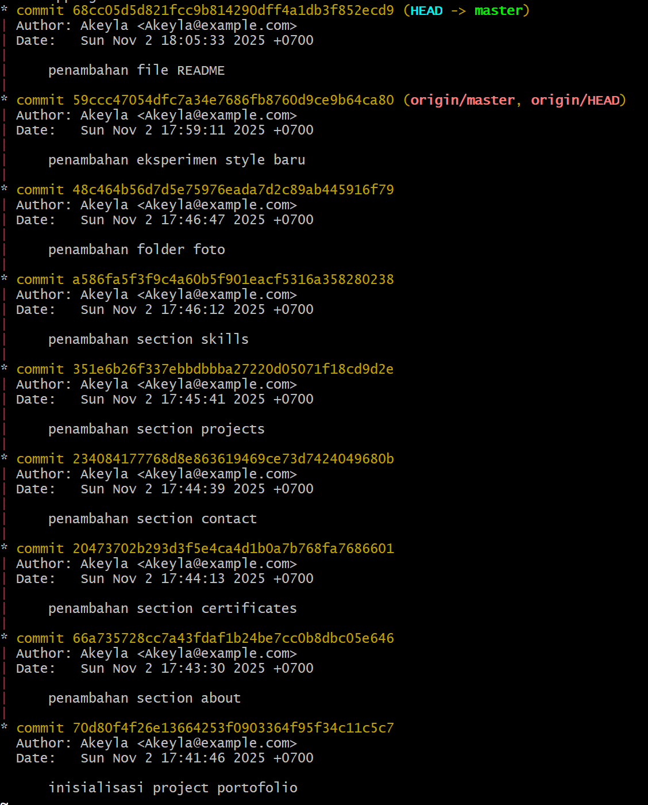
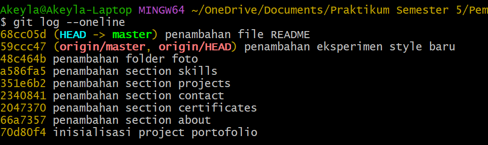

# Portofolio — Puan Akeyla Maharani Munaji

Situs portofolio statis yang berisi halaman beranda, informasi tentang penulis, proyek, sertifikat, keahlian, dan kontak. Proyek ini dibuat sebagai tugas/percobaan pada mata kuliah Pemrograman Web.

## Ringkasan
- Nama: Portofolio Puan Akeyla
- Bahasa: Bahasa Indonesia
- Teknologi: HTML, CSS, Font Awesome (CDN)
- Struktur sederhana: halaman statis yang dapat dibuka di browser tanpa backend

## Fitur
- Halaman Beranda (`index.html`) dengan foto profil dan tombol ke proyek/kontak
- Halaman `about.html` untuk deskripsi diri
- Halaman `projects.html` untuk daftar proyek
- Halaman `certificates.html` menampilkan kartu sertifikat (terhubung ke Google Drive)
- Halaman `skills.html` menampilkan keahlian
- Halaman `contact.html` berisi kontak dan link media sosial
- Styling berada di `style.css`
- Folder `img/` berisi aset gambar (foto profil, thumbnail sertifikat, dsb.)

## Struktur proyek

Root:

- `index.html` — Beranda
- `about.html` — Tentang Saya
- `projects.html` — Proyek
- `certificates.html` — Sertifikat
- `skills.html` — Keahlian
- `contact.html` — Kontak
- `style.css` — Gaya (CSS)
- `img/` — Gambar dan aset
- `README.md` — (file ini)

## Instalasi
Proyek ini adalah situs statis sederhana tidak ada build step, package manager, atau server khusus yang diperlukan. Berikut beberapa cara yang mudah dan teruji untuk menjalankannya secara lokal.

Persyaratan singkat:
- Browser modern (Chrome, Firefox, Edge, Safari)
- Editor teks (opsional): VS Code, Notepad++, dsb.
- (Opsional) Python 3 atau Node.js jika ingin menjalankan server lokal dari terminal

Metode A Buka langsung (cara tercepat)
- Buka File Explorer, menuju folder proyek, lalu klik dua kali `index.html`.
- Kelebihan: sangat cepat; Kekurangan: beberapa fitur (fetch, routing relatif) mungkin tidak bekerja sempurna.

Metode B Live Server (VS Code) — Direkomendasikan untuk pengembangan
1. Buka folder proyek di VS Code.
2. Install ekstensi "Live Server" (jika belum terpasang).
3. Klik kanan `index.html` -> "Open with Live Server" atau klik tombol "Go Live" di pojok kanan bawah.
4. Browser akan terbuka otomatis dan perubahan file akan ter-refresh secara real-time.

Metode C Python simple HTTP server (PowerShell)
1. Buka PowerShell.
2. Pindah ke direktori proyek:

```powershell
cd "c:\Users\Akeyla\OneDrive\Documents\Praktikum Semester 5\Pemrograman Web\PERCOBAAN 2\TA_PERCOBAAN_2"
```
3. Jalankan server (Python 3):

```powershell
python -m http.server 8000
# atau jika "python" tidak tersedia gunakan:
py -3 -m http.server 8000
```
4. Buka http://localhost:8000 di browser.

Metode D — Node (opsional)
1. Jika ada Node.js terpasang, pasang http-server sekali saja:

```powershell
npm install -g http-server
```
2. Jalankan dari folder proyek:

```powershell
http-server -p 8000
```

Tips singkat:
- Jika browser menampilkan error terkait CORS atau fetch, gunakan server lokal (Metode B/C/D).
- Jika port 8000 sudah terpakai, ganti nomor port (mis. 3000).

## Penggunaan
Berikut panduan singkat untuk bekerja dan mengedit situs ini dengan nyaman.

1) Menavigasi situs
- Gunakan menu di header untuk pindah antar halaman: Beranda, Tentang Saya, Proyek, Sertifikat, Keahlian, Kontak.
- Di halaman `certificates.html` klik kartu sertifikat akan membuka berkas di Google Drive (link external).

2) Mengedit konten dan melihat perubahan
- Buka file HTML yang ingin diubah (mis. `index.html`, `projects.html`, `contact.html`) di editor.
- Simpan file setelah edit. Jika menggunakan Live Server, halaman akan reload otomatis. Jika tidak, refresh browser manual.

3) Menambahkan gambar
- Letakkan file gambar di folder `img/`.
- Gunakan tag `` pada file HTML yang relevan.
- Gunakan format JPEG/PNG/WebP. Untuk web, usahakan ukuran gambar tidak terlalu besar (<= 200-500 KB) agar loading cepat.

4) Menambah item proyek (snippet cepat)
Tambahkan blok ini ke `projects.html` di dalam container proyek:

```html
<div class="project-card">
	<h3>Judul Proyek</h3>
	<p>Deskripsi singkat proyek — teknologi yang dipakai dan link demo / repositori.</p>
	<a href="#" class="btn">Lihat</a>
</div>
```

5) Memperbarui sertifikat
- Buka `certificates.html` dan update link `href` pada tiap kartu untuk menunjuk ke URL sertifikat yang benar (Google Drive atau file host lain).

6) Preview & validasi
- Setelah perubahan, cek di beberapa browser dan ukuran layar (responsiveness).
- Perhatikan accessibility dasar: selalu isi atribut `alt` pada gambar dan gunakan heading (h1-h3) dengan urutan yang baik.

## Menambahkan/mengubah konten cepat
- Gambar baru: taruh file di `img/` dan perbarui tag `` pada halaman yang sesuai.
- Menambah proyek: buka `projects.html` dan tambahkan blok HTML untuk proyek baru (judul, deskripsi, link).
- Perbarui kontak di footer (semua halaman memiliki footer yang sama) — untuk perbaikan lebih rapi pertimbangkan membuat template atau menggunakan server-side includes jika diperluas.

## Kontribusi
Ini adalah proyek pribadi/tugas. Bila ingin kontribusi atau perbaikan (mis. optimasi mobile, aksesibilitas, atau deployment), silakan buat branch dan ajukan PR atau hubungi pemilik melalui email yang tertera di footer.

## Kontak
- Email: puan.akeyla37@gmail.com
- GitHub: https://github.com/puanakeyla
- LinkedIn / Instagram: link tersedia di footer setiap halaman

---

## Preview (Visuals)
Berikut dua gambar visual yang ada di folder `img/`. Jika Anda membuka `README.md` di GitHub atau viewer yang mendukung relative image paths, gambar akan tampil langsung.

Graph overview:



Online preview badge:



